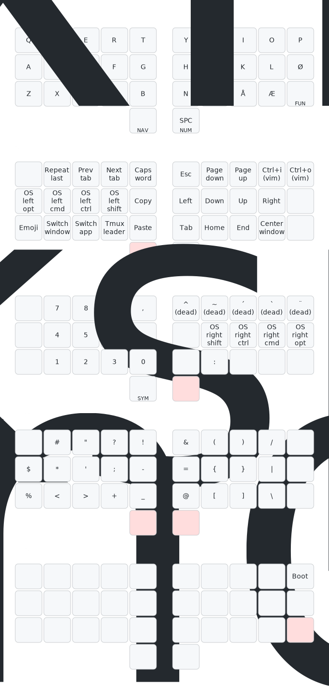

# Tomas's split 32 key layout

My custom split keymap, mostly based upon
[callum's layout](https://github.com/qmk/qmk_firmware/blob/user-keymaps-still-present/users/callum/readme.md).

## Background

The main goal of this keymap is to keep things simple, and to have my most
frequently used keys on my strongest fingers and make sure my fingers are moving
in the most comfortable directions.

Being simple means that there should only be one way to type a character, and
that there are little to none timers involved, to make sure anything can be
typed at any pace. This is accomplished by using QMK's one shot feature for
doing modifiers for instance. I have tried to collect keys in somewhat
reasonable layers, though some symbols might be on other layers than you might
expect, mostly due to space limitations.

Keeping most frequently used keys accessible on my strongest fingers is also
important to me. I have been having some wrist and arm issues, so this keymap is
optimized for using the fingers that are least painful for most of the work, and
moving them in directions which feels most natural to me. This for instance, is
the reasoning for keeping only one thumb key on each hand, and working around
this as a limitation.

## Keymap overview

